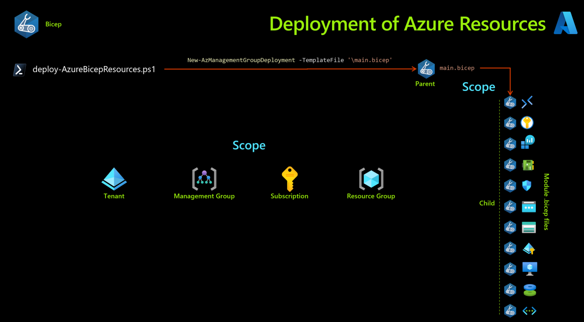
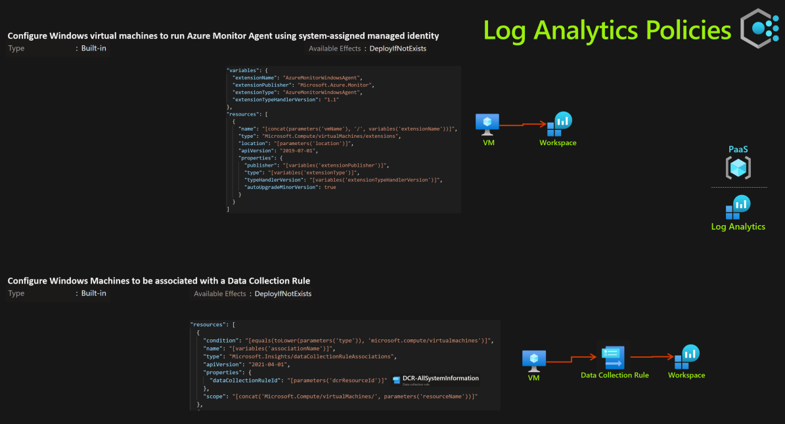
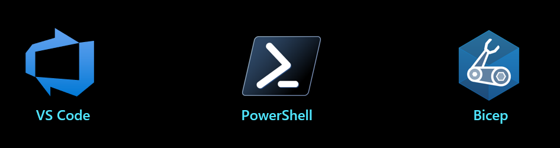
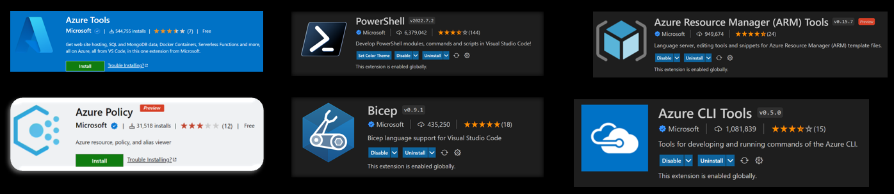
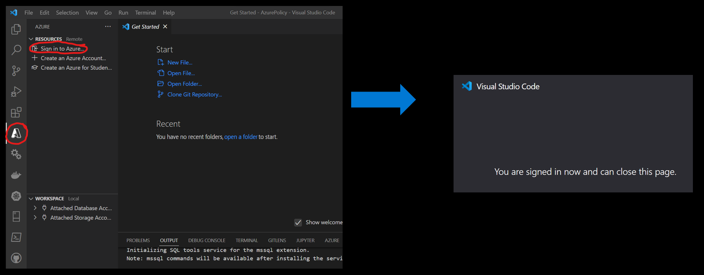
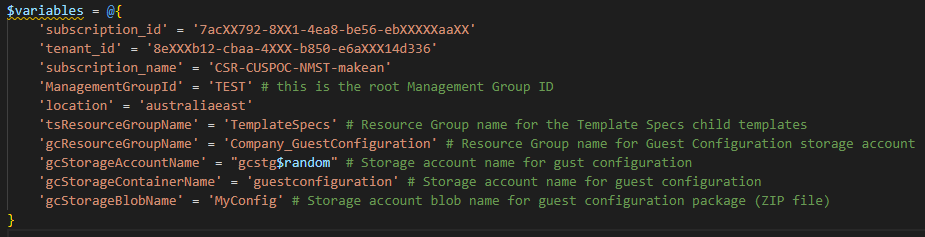

# AzurePolicyWorkshop

- [AzurePolicyWorkshop](#azurepolicyworkshop)
  - [Agenda](#agenda)
    - [Day 1](#day-1)
    - [Day 2](#day-2)
    - [Day 3](#day-3)
  - [Setup the local tools & environment](#setup-the-local-tools--environment)
  - [Variables](#variables)
  - [Labs](#labs)
    - [Deployment of Azure resources - Bicep](#deployment-of-azure-resources---bicep)
    - [Deployment of Azure Built-In Policies - Bicep](#deployment-of-azure-built-in-policies---bicep)
    - [Deployment of Azure Custom Policies - JSON](#deployment-of-azure-custom-policies---json)
    - [Testing Azure Policies - Bicep](#testing-azure-policies---bicep)
    - [Deployment of Azure Resource Exemptions - Bicep](#deployment-of-azure-resource-exemptions---bicep)
    - [Testing Azure Resource Exemptions - Bicep](#testing-azure-resource-exemptions---bicep)
    - [Deployment of Guest Config VM Extension - JSON](#deployment-of-guest-config-vm-extension---json)
    - [Deployment of Guest Config Policies - JSON](#deployment-of-guest-config-policies---json)

## Agenda

### Day 1

1. Tooling

    We install all the tools needed for successful policy configuration & deployment

2. Scope

    We look at two types of scope here. Deployment scope and Policy scope

3. Deployment of test Azure resources (Lab)

    In this lab, we use Bicep templates to deploy test Azure resources in order to test Azure Policy against. We use pre-written Bicep templates in order to deploy what we need
    - This is a lab exercise

    

4. Effects

    Each policy definition in Azure Policy has a single effect. That effect determines what happens when the policy rule is evaluated to match. The effects behave differently if they are for a new resource, an updated resource, or an existing resource.

5. Policy Functions

    All [resource Manager template functions](https://docs.microsoft.com/en-us/azure/azure-resource-manager/templates/template-functions) are available to use within a policy rule, except certain functions and user-defined functions.

### Day 2

6. Policy Definitions

    Policy Definitions define a Policy. We look at both options for built-in Policy Definitions and Custom Policy Definitions. We understand the best practice of where custom Policy Definitions live in an Azure subscription and the structure of Policy Definitions.

7. Policy Initiatives

    A Policy Initiatives are the new name for Policy Set Definitions and is like a group of Policy Definitions.

8. Policy Assignments

    We can assign both Policy Initiatives and Policy Definitions to scope, either a scope comprising of a Management Group, subscription or resource group

9. Deployment of **built-in** Azure Policy Assignments (Lab)

    In this lab, we use BICEP templates to deploy built-in Azure policy definitions, then assign these definitions. This demonstrates how to govern the Azure resources

    As some policies are either DeployIfNotExists or Modify, we also assign some built-in roles to the policy service principals
    
    This is a lab exercise

    - Configure Windows machines to run Azure Monitor Agent and associate them to a Data Collection Rule
      
      | | |
      |----|----|
      |Policy Type|Initiative|
      |Assignment Scope|Resource Group|
      |Definitions|Configure Windows Machines to be associated with a Data Collection Rule 
 Configure Windows virtual machines to run Azure Monitor Agent using system-assigned managed identity|
        
        

    - Allowed_Locations
      | | |
      |----|----|
      |Policy Type|Definition|
      |Assignment Scope|Subscription|

10. Deployment of **custom** Azure Policies (Lab)

    In this lab, we use JSON templates to deploy custom Azure policy definitions, then assign these definitions. This demonstrates how to govern the Azure resources

    As some policies are either DeployIfNotExists or Modify, we also assign some built-in roles to the policy service principals
    
    This is a lab exercise

    - Secure transfer to storage accounts should be enabled

      | | |
      |----|----|
      |Policy Type|Definition|
      |Assignment Scope|Subscription|

    

    - No RDP 3389 or SSH 22 from the internet

      | | |
      |----|----|
      |Policy Type|Definition|
      |Assignment Scope|Subscription|

    

    - Azure KeyVault desired settings

      | | |
      |----|----|
      |Policy Type|Definition|
      |Assignment Scope|Subscription|

    

    - Deny deployment of a custom role which has the same permissions as the built-in owner role

      | | |
      |----|----|
      |Policy Type|Definition|
      |Assignment Scope|Subscription|
    - Deny deployment of an NSG that contains NSG rules with port 22 or 3389 as destination ports
      | | |
      |----|----|
      |Policy Type|Definition|
      |Assignment Scope|Subscription|

    

11. Testing Azure Policies (Lab)
  - We test the Azure Policies we have deployed in the previous lab exercise
  - For this test we will use Bicep to deploy NSGs with ports opened from the internet on port 3389, 322  443 so see the effect that Azure Policy has on the resources being deployed. 

12. Exemptions

    The Azure Policy exemptions feature is used to exempt a resource hierarchy or an individual resource from evaluation of initiatives or definitions. Resources that are exempt count toward overall compliance, but can't be evaluated or have a temporary waiver.

13. Exemptions (Lab)
  - In this lab we deploy a policy exemption, to ensure that a particular resource group **Company_Open** is exempt from the **Allowed_Locations** Policy.
  - We also test deploy some simple Azure resources using BICEP to test this Policy Exemption and to watch the effects of the exemption.
  - We deploy public IP addresses in different Azure regions to both **Company_Network** and **Company_Open** resource groups to watch the effects of the exemption.

  

### Day 3

14. Compliance

    Look at compliance Vs non-compliance and the Policy compliance checker.

15. Remediation

    Looking at Remediation, remediation of non-compliant resources. Resources that are non-compliant to policies with deployIfNotExists or modify effects can be put into a compliant state through Remediation.

16. Remediation (Lab)

    In this lab we use the Azure portal and work with the previously deployed Azure test resources and Azure policies to remediate non-compliant resources.

17. Managed Identities

    We understand what are managed identities and how that are used in conjunction with the two effects, **deployIfNotExists** or **Modify**.

18. Regulatory Compliance in Azure Policy

    Regulatory Compliance in Azure Policy provides built-in initiative definitions to view a list of the controls and compliance domains based on responsibility (Customer, Microsoft, Shared).

19. Policy Testing

    We look at ways to test Azure Policy without initiating the policy effect or triggering entries in the Azure Activity log.

20. Guest Configuration/Azure Automanage Machine Configuration (Lab)

    There are two labs here, one is for the **Guest Config VM extension deployment**, the other one is for the **Guest Config Policies** themselves. 
    
    We deploy a Policy Initiative that installs the Guest Configuration extension on all Windows and Linux virtual machines in a Resource Group.

    - Deploy prerequisites to enable Guest Configuration policies on virtual machines

    | | |
    |----|----|
    |Policy Type|Initiative|
    |Assignment Scope|Resource Group|

    

21. Guest Configuration/Azure Automanage Machine Configuration

    Azure Policy's guest configuration feature provides native capability to audit or configure operating system settings as code, both for machines running in Azure and hybrid Arc-enabled machines. The feature can be used directly per-machine, or at-scale orchestrated by Azure Policy.
    
    We run some tests on Virtual Machines running in Azure

    

## Setup the local tools & environment

1. Install all the following extensions in VS Code

2. [Install the Azure extension for VS Code](https://marketplace.visualstudio.com/items?itemName=ms-vscode.vscode-node-azure-pack).

Then sign into Azure.

3. [Install PowerShell on Windows, Linux, and macOS](https://docs.microsoft.com/en-us/powershell/scripting/install/installing-powershell)

[Install PowerShell v7 on Windows if you’re a non-admin](https://apps.microsoft.com/store/detail/powershell/9MZ1SNWT0N5D?hl=en-au&gl=AU)

4. [Install the Azure Az PowerShell module](https://docs.microsoft.com/en-us/powershell/azure/install-az-ps)

5. [Install Bicep tools & Azure CLI](https://docs.microsoft.com/en-us/azure/azure-resource-manager/bicep/install)

 You must have Azure CLI version 2.20.0 or later installed. Azure CLI automatically installs the Bicep CLI when a command is executed that needs it.
 
 You can install the Bicep CLI and add it to your PATH. Or, [you must manually install Bicep ](https://docs.microsoft.com/en-us/azure/azure-resource-manager/bicep/install#install-manually) for any use other than Azure CLI, as this adds Bicep to the PATH for you. 
 
 Supported OS’s are Linux, MacOS, Windows

## Variables

The variables to use in all the files in this workshop are contained in the one single file, so you only need to enter once. You can find the variables file [here](/01%20Variables/).

## Labs

Below are the labs in which you deploy with code. Note, one lab **remediation** is an interactive lab which is done in the Azure Portal.

### Deployment of Azure resources - Bicep

Run the `deploy-AzureBicepResources.ps1` file in the [02 Deployment of Azure resources](/02%20Deployment%20of%20Azure%20resources/parentTemplates/) folder.

### Deployment of Azure Built-In Policies - Bicep

Run the `deploy-AzureBicepResources.ps1` file in the [03.1 Deployment of Azure Resource Policies (BICEP)](/03.1%20Deployment%20of%20Azure%20Resource%20Policies%20(BICEP)/parent_PolicyTemplates) folder.

### Deployment of Azure Custom Policies - JSON

Run the `deploy-AzureBicepResources.ps1` file in the [03.2 Deployment of Azure Resource Policies (JSON)](/03.2%20Deployment%20of%20Azure%20Resource%20Policies%20(JSON)/parent_PolicyTemplates) folder.

### Testing Azure Policies - Bicep

Run the `deploy-AzureBicepResources.ps1` file in the [03.3 Testing Azure Policies](/03.3%20Testing%20Azure%20Policies/parentTemplates/) folder.

### Deployment of Azure Resource Exemptions - Bicep

Run the `deploy-AzureBicepResources.ps1` file in the [04.1 Deployment of Azure Policy Exemption (BICEP)](/03%20Deployment%20of%20Azure%20Resource%20Exemptions%20(BICEP)/parentTemplates) folder.

### Testing Azure Resource Exemptions - Bicep

Run the `deploy-guestConfigurationPolicies.ps1` file in the [04.2 Testing Azure Resource Exemptions (BICEP)](/04%20Deployment%20of%20Guest%20Config%20VM%20Extension/parent_PolicyTemplates/) folder.

### Deployment of Guest Config VM Extension - JSON

Run the `deploy-guestConfigurationPolicies.ps1` file in the [05 Deployment of Guest Config VM Extension](/05%20Deployment%20of%20Guest%20Config%20VM%20Extension/parent_PolicyTemplates/) folder.

### Deployment of Guest Config Policies - JSON

Run the `deploy-guestConfigurationPolicies.ps1` file in the [06 Deployment of Guest Config Policies](/06%20Deployment%20of%20Guest%20Config%20Policies/parent_PolicyTemplates/) folder.